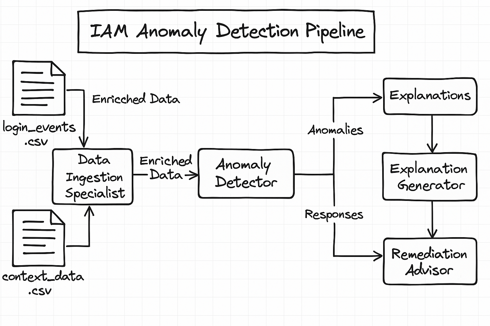

🛡️ AccessMonitor 360: Multi-Agent IAM Anomaly Analyzer
AccessMonitor 360 is an autonomous multi-agent system built using CrewAI and OpenAI's GPT-4. It detects and interprets suspicious IAM login behaviors by fusing identity telemetry with environmental context.

📌 Key Features
- Anomaly Detection: Flags login events with low Wilson scores indicating rare or suspicious behavior.

- GenAI Risk Assessment: Uses LLMs to assess whether anomalous activity is truly malicious based on contextual metadata (e.g., environment, application).

- Explanation Agent: Converts technical analysis into analyst-friendly summaries.

- Remediation Agent: Recommends actionable steps like disabling accounts or alerting SOC teams.

📁 Input Files

- login_events.csv	Contains login attempts with src_ip, username, wilson_score
- context_data.csv	Contains src_ip mapped to hostname, application_id, environment_type

CrewAI Agents

- Data Ingestion Specialist:	Merges telemetry and context to produce enriched data
- Anomaly Detector:	Flags records with low Wilson scores as potential risks
- GenAI Risk Assessor:	Uses LLM to assess risk level for each flagged anomaly
- Explanation Agent:	Summarizes risk findings for Tier-1 SOC analysts
- Remediation Agent:	Recommends next actions (e.g. enforce MFA, disable account, investigate)

 How to Run
1. Install dependencies

bash
Copy
Edit
pip install -r requirements.txt

2. Set your OpenAI API Key
Create a .env file or set the variable in your shell:

export OPENAI_API_KEY=your_openai_key_here
